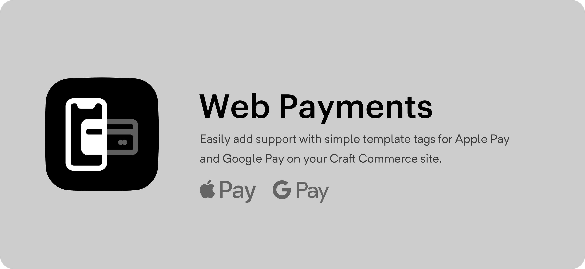

# Web Payments for Craft Commerce

Use the Web Payments API and Apply & Google Pay to vastly improve your checkout process!

## Usage
### Setup
After installing the plugin:

1. Create a [Stripe payment gateway](https://plugins.craftcms.com/commerce-stripe).
2. Select the gateway in the plugin options.
3. Register your domain with Stripe and Apple Pay (Simply add your domain [here](https://dashboard.stripe.com/account/apple_pay)).
4. Output the button where ever you want using the template tag below.
5. ???
6. Profit.

### `{{ craft.webPayments.button(options) }}`
Place this twig where you want the payments button to appear.

#### Options
Pass a twig object as the only parameter to configure the button.

##### `items`
An array of items to buy. Use this **OR** `cart`.

##### `items[x].id`
The ID of the purchasable.

##### `items[x].qty`
The Qty being purchased.

##### `cart`
A Craft Commerce Order (i.e. the current cart). Use this **OR** `items`.

##### `requestShipping`
A boolean or string. If true a shipping address will be required. Can also be 
set to one of: `'shipping'`, `'delivery'`, `'pickup'`, `true`, `false` (default).
This will also change how the UI refers to the shipping of the products. For 
example, in English speaking countries you would say "pizza delivery" not 
"pizza shipping". Setting this to true will default the working to "shipping".

##### `requestDetails`
An array of additional details to request. Any of: `name`, `email` (email is 
always collected, so you don't need to add it), `phone`.

##### `onComplete`
An object of events to trigger once the payment is complete.

##### `onComplete.redirect`
A URL to redirect to once the payment is completed. Can include `{number}`, 
which will output the order number.

##### `onComplete.js`
JavaScript that will be executed once the payment is complete. Has access to the 
`cwp` object. Currently this only has `cwp.number` (the order number).

##### `js`
The variable the button will be set to in JS. Useful if you want to dynamically
update the items in the virtual cart.

##### `style`
Customize the appearance of the button:

```js
{
    type: 'default' | 'donate' | 'buy', // default: 'default'
    theme: 'dark' | 'light' | 'light-outline', // default: 'dark'
    height: '64px', // default: '40px', the width is always '100%'
}
```

## Example
```twig
{{ craft.webPayments.button({
    items: [
        { 
            id: product.defaultVariant.id, 
            qty: 1,
            options: {
                giftWrapped: 'yes',
            },
         },
    ],
    requestShipping: 'delivery',
    js: 'window.pay_item_' ~ product.id,
}) }}
```

```twig
{{ craft.webPayments.button({
    cart: craft.commerce.carts.cart,
    requestDetails: ['name', 'phone'],
    onComplete: {
        redirect: '/thanks?number={number}',
        js: 'window.paymentCompleted(cwp.number);',
    },
}) }}
```

## Dynamic Updating
You can dynamically update the button via JS. 

Use the `js` option to define the variable you want the button to be bound to:

```twig
{{ craft.webPayments.button({
    items: [{ id: 1, qty: 1 }],
    js: 'window.payButton',
}) }}
```

You can then get the current items and update them:

```js
const items = [ ...window.payButton.items ];
items[0].options = { giftWrapped: 'yes' };
window.payButton.items = items;
```

You **can't** update the items directly (i.e. `window.payButton.items[0].id = 2`). 
The `items` are immutable, and therefore must be set to a new array if you want 
to update them. Above we are cloning the existing items into a new array before 
modifying them.

If you passed in a cart you can simply call `refresh()` to update the button 
with the latest contents of the cart.

```js
window.payButton.refresh();
```

Note that you can't update the button while the payment dialog is active.

If you need to reload the button (i.e. if the DOM has changed) you can use the 
`reload()` function.

```js
window.payButton = window.payButton.reload();
```

`reload()` will return a new instance of the button, so you'll want to replace 
your existing variable with that new instance.

## TODO
- [x] When using a cart, actually use the cart to keep fields / options persistent
  - [x] Remove cart option (if items isn't set, use active cart)
  - [x] Remove clear cart option
- [x] Support line item options when using items
- [x] On payment complete event (i.e. clear active cart, redirect to thanks)
- [x] JS hooks to update items (if not using commerce cart)
- [x] JS hook to refresh cart data (if using commerce cart)
- [ ] Option to use default Apple / Google Pay buttons (rather that Stripe's button)
- [x] Use billing address from Stripe (don't set billing address to shipping)
- [x] Make shipping address optional
- [x] Settings:
  - [x] Select Stripe gateway
  - [x] Button config defaults
  - [x] Map request details (name, phone) to order fields
- [x] Write setup instructions
- [x] Browser test JS
- [x] Test with Commerce Lite
- [x] Add flag to order marking this as an order completed via web payments
- [ ] Add subscription support